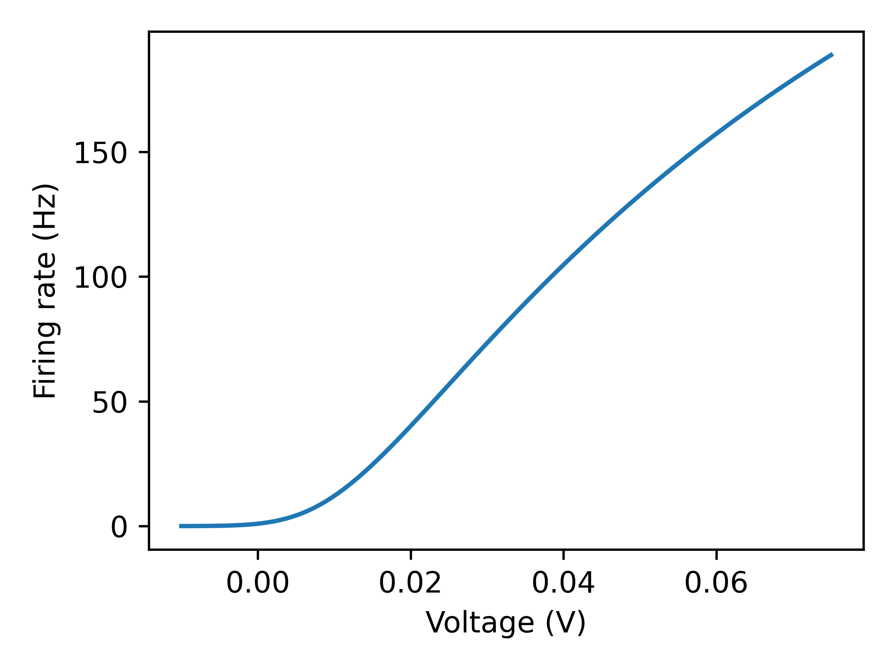

# About
An efficient, GPU-friendly, and differentiable PyTorch implementation of the Ricciardi transfer function based on equations and default parameters from [Sanzeni et al. (2020)](https://journals.plos.org/ploscompbiol/article?id=10.1371/journal.pcbi.1008165).

<center></center>

# Usage
For using the ricciardi function in your own code, you can either just copy the source file at `src/ricciardi/ricciardi.py` to your own code, or install the package in your python environment with `pip install ricciardi` and import the function with `from ricciardi import ricciardi`. To run tests, clone the repository, create a new environment, install the neccessary packages with `pip install -r requirements`, and run the command `pytest`.

# Implementation
The Ricciardi transfer function, in the notation of Sanzeni et al. (2020), is given by

$$
f(\mu) = \left[\tau_{rp} + \tau\sqrt{\pi}\int_{u_\mathrm{min}(\mu)}^{u_\mathrm{max}(\mu)}e^{u^2}(1+\mathrm{erf}(u)) du\right]^{-1}
$$

where

$$
u_\mathrm{max}(\mu) = \frac{\theta - \mu}{\sigma}, u_\mathrm{min}(\mu) = \frac{V_r - \mu}{\sigma}
$$

The integral can be written in terms of the hypergeometric function ${}_2F_2$. However, there is currently no implementation of this hypergeometric function that is performant enough for large neural network simulations. Thus we take the approach of directly computing the integral with a fixed order Gauss-Legendre quadrature rule. We find that an order 5 quadrature is sufficient to obtain good numerical accuracy for realistic parameter regimes.

## A note on the computation of the integral
Direct computation of $e^{x^2}(1 + \mathrm{erf}(x))$ results in numerical issues for large, negative $x$ since the first term is huge while the second term is tiny. To address this, we note that since $1 + \mathrm{erf}(x) = 1 - \mathrm{erf}(-x)$, we can rewrite the integral as

$$
f(\mu) = \left[\tau_{rp} + \tau\sqrt{\pi}\int_{-u_\mathrm{max}(\mu)}^{-u_\mathrm{min}(\mu)} \mathrm{erfcx}(u) du\right]^{-1}
$$

where $\mathrm{erfcx}$ is the scaled complementary error function defined by

$$
\mathrm{erfcx}(x) = e^{x^2}(1 - \mathrm{erf}(x))
$$

$\mathrm{erfcx}$ is a native PyTorch function which has high precision for a wide range of inputs, so by using it we avoid the numerical issue mentioned above.


# Benchmark
Compare performance with a naive, linear interpolation-based approach. Forward pass is slightly faster, and backward pass is much faster (>2x on GPU).

Results on CPU (AMD EPYC 7662, 8 cores) (`python benchmark/benchmark.py -N 100000 -r 100`):
```
forward pass, requires_grad=False
ricciardi: median=1.81 ms, min=1.79 ms (100 repeats)
ricciardi_interp: median=1.91 ms, min=1.9 ms (100 repeats)

forward pass, requires_grad=True
ricciardi: median=1.8 ms, min=1.79 ms (100 repeats)
ricciardi_interp: median=2.11 ms, min=1.98 ms (100 repeats)

backward pass
ricciardi: median=786 μs, min=765 μs (100 repeats)
ricciardi_interp: median=1.17 ms, min=1.09 ms (100 repeats)
```

Results on GPU (Nvidia A40) (`python benchmark/benchmark.py -N 100000 -r 100 --device cuda`):
```
forward pass, requires_grad=False
ricciardi: median=451 μs, min=441 μs (100 repeats)
ricciardi_interp: median=455 μs, min=448 μs (100 repeats)

forward pass, requires_grad=True
ricciardi: median=478 μs, min=470 μs (100 repeats)
ricciardi_interp: median=523 μs, min=513 μs (100 repeats)

backward pass
ricciardi: median=486 μs, min=475 μs (100 repeats)
ricciardi_interp: median=1.1 ms, min=1.08 ms (100 repeats)
```
